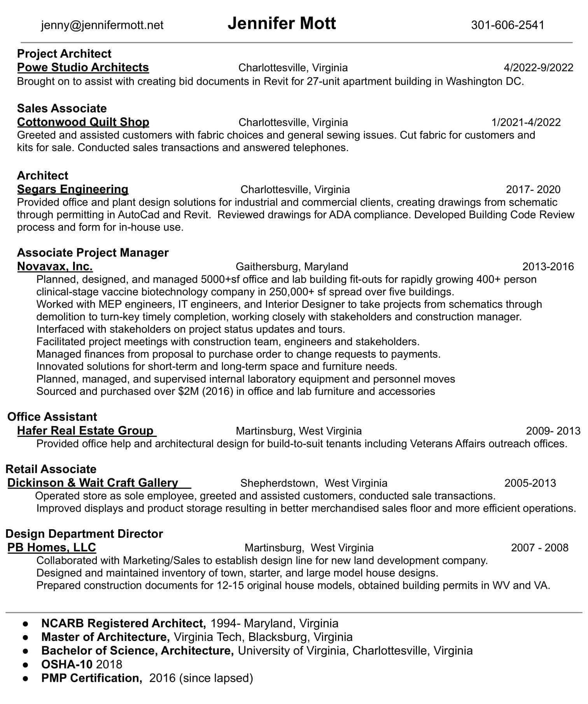

I've had a long and varied career in architectural and developer's offices, a real estate office, a bio-tech company, and a few retail establishments for variety. I have worked in restaurants, both in the back and the front of the house. I have been a newspaper columnist, and EMT, a rock and roll disc jockey, a radio news anchor, a master gardener, and a plant merchandiser. Every job has added value to my design 'tool box'. I hold a BS in Architecture and a Master of Architecture. I am proficient in:

* Revit
* AutoCAD
* Commercial and Residential architecture
* Design and Planning

### Resume

### In My Free Time

I am the Treasurer of the Jack Jouett Chapter of the National Society of the Daughters of the American Revolution. I enjoy knitting, sewing, and general crafts. I also love learning about local nature, photography, and spending some time at the shooting range.
