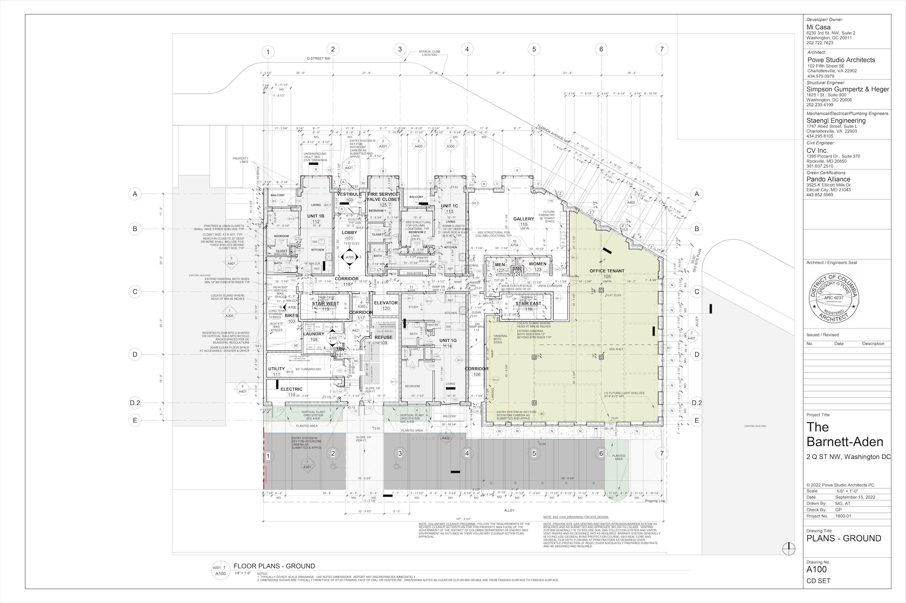
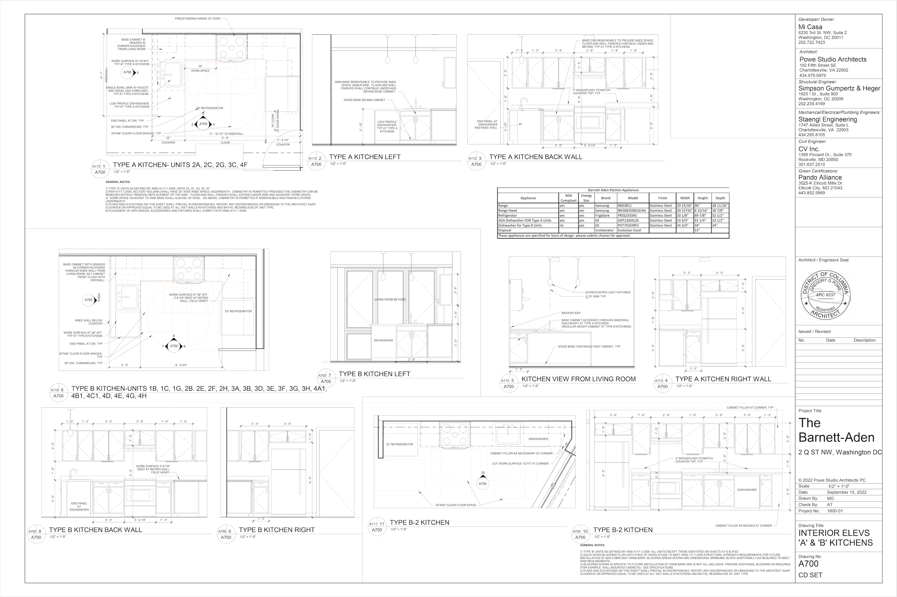
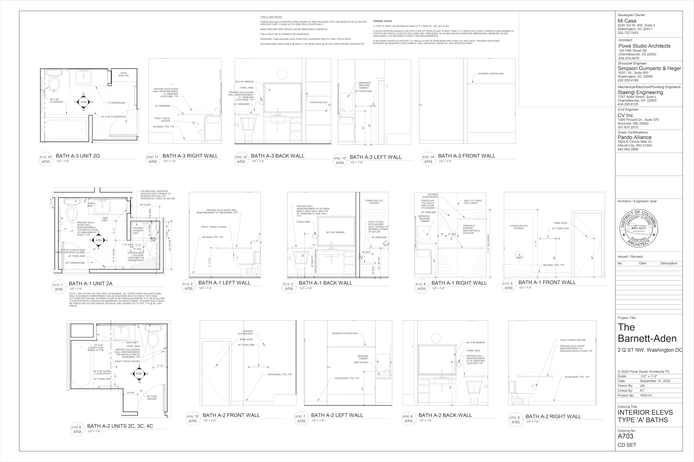
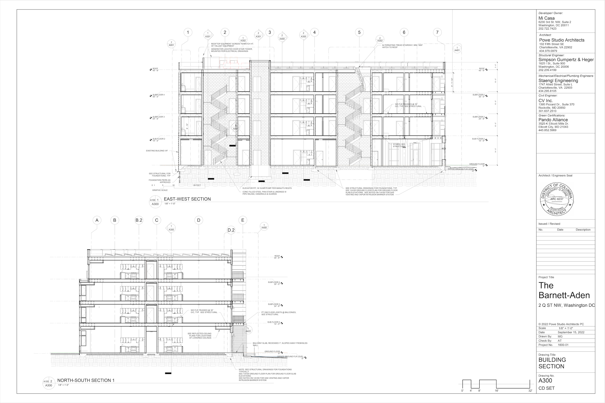
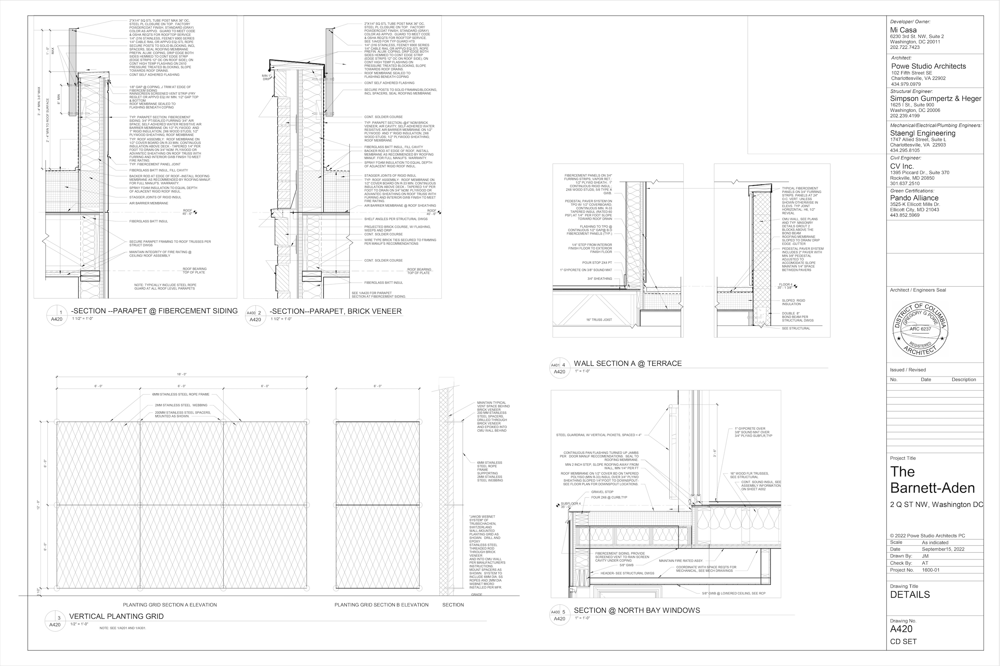

I was hired to assist as a Project Architect at Powe Studio
Architects to take the project from Design Development to Bid Documents in Revit. I created wall
sections, building sections, unit plans, kitchen and bath drawings per IBC, DCBC, and ADA 2010. The project is now in bidding phase.

These images are very high resolution. Best to open images in a new tab for a closer look.

## Ground Floor

## Kitchens

## Bath Elevations

## Wall Sections

