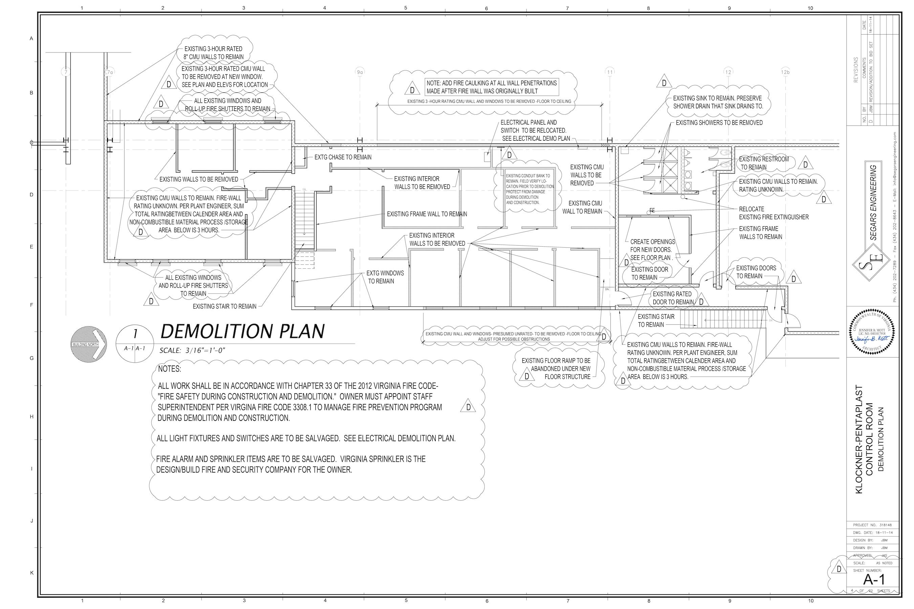
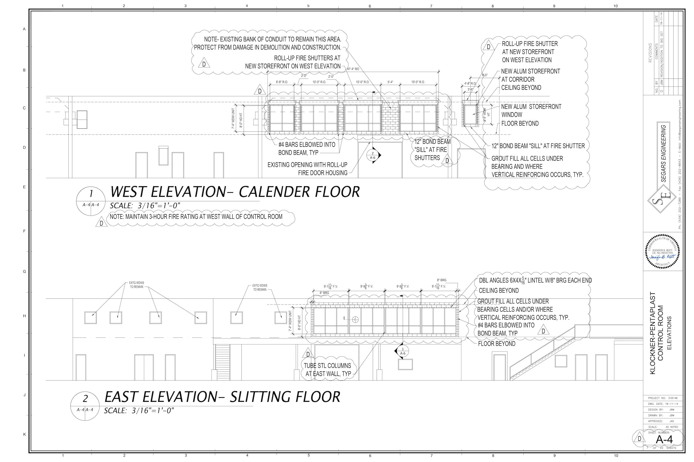
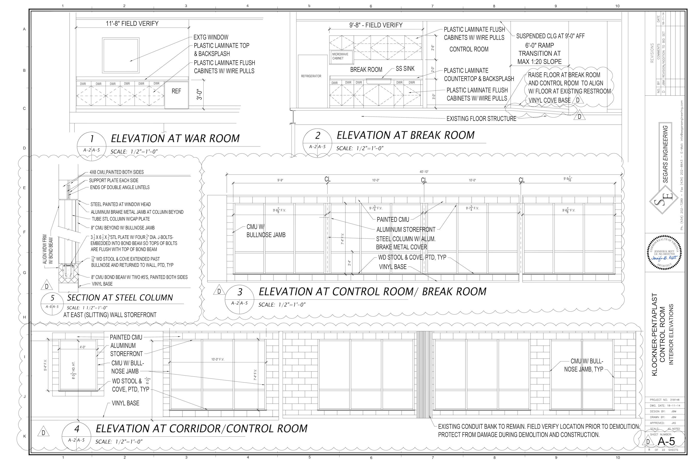

Renovation of existing second-floor office and
storage area into double-sided Control Room, office, and conference space. Existing unused
space was ideally positioned for use as control room for large factory floor below. Design and
drawings in Autocad by me with analysis of complicated code issues of existing fire shutters and
assistance of additional architect.

Click on images to see full resolution.

## Demolition Plan

## Elevations

