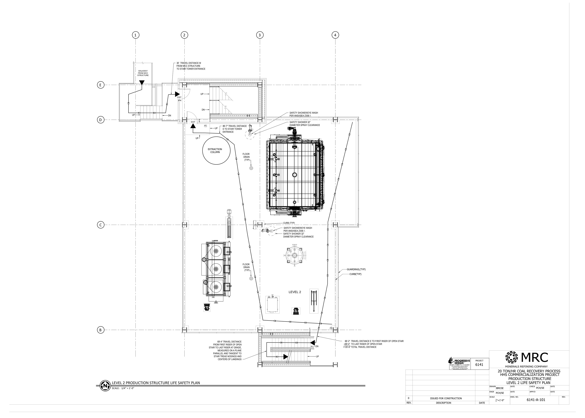
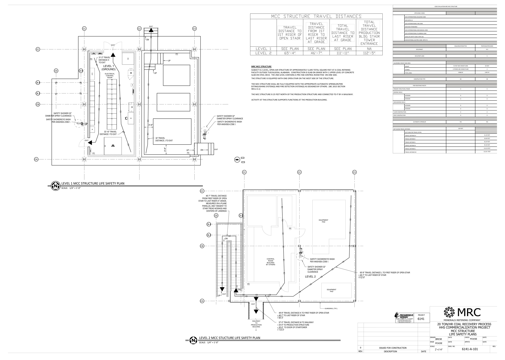

Life Safety and IBC
Review of 4-level open-air, minimally-manned, heavy industrial structure. I completed reviews
and Autocad drawings in conjunction with Segars Engineering.

Click on images to see full resolution.

## Level 2

