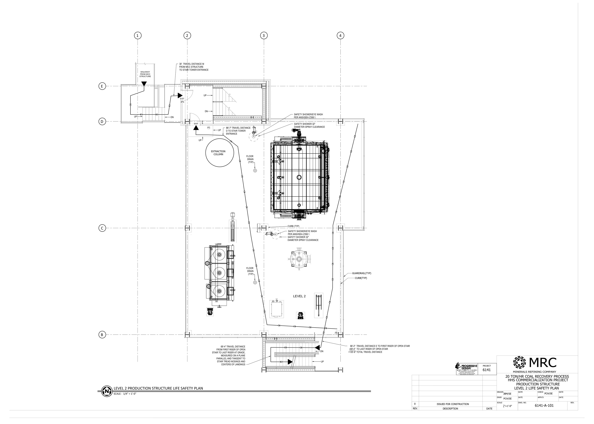

Life Safety and IBC
Review of 4-level open-air, minimally-manned, heavy industrial structure. I completed reviews
and Autocad drawings in conjunction with Segars Engineering.

These images are very high resolution. Best to open images in a new tab for a closer look.

## Level 2

